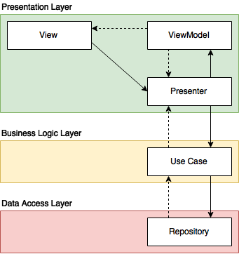

# Android Kotlin Clean MVP-VM

An android project implementing clean architecture with MVP-VM presentation.

## Getting started

### Configuration

Create a `project.properties` file in the root directory of your project. Add
environment-specific variables on new lines in the form of `NAME=VALUE`.

See [`project.example.properties`](https://github.com/WhatTheFar/android-clean-mvp-vm/blob/master/project.example.properties) for example.

> Note: OpenWeatherMap APIs Key is required in the `project.properties` file. Please sign up at [openweathermap.org](https://openweathermap.org) and create an API key. Don't worry about pricing, it's free.

## Clean Architecture

## Architectural approach

## Architectural reactive approach

## Model-View-Presenter-ViewModel

## References

[Clean Architecture](https://8thlight.com/blog/uncle-bob/2012/08/13/the-clean-architecture.html)

[Android App Architecture Ground Up](https://android.jlelse.eu/android-app-architecture-ground-up-d634eda1f21d)

[Android-Kotlin-Clean-Architecture](https://github.com/sanogueralorenzo/Android-Kotlin-Clean-Architecture)

[Gradle Dependency Management with Kotlin (buildSrc)](https://proandroiddev.com/gradle-dependency-management-with-kotlin-94eed4df9a28)

[CircleCI Android Documentation](https://circleci.com/docs/2.0/language-android/)

## Discussions

Refer to the issues section: https://github.com/WhatTheFar/android-clean-mvp-vm/issues

## License

    Copyright 2018 Jakpat Mingmongkolmitr

    Licensed under the Apache License, Version 2.0 (the "License");
    you may not use this file except in compliance with the License.
    You may obtain a copy of the License at

       http://www.apache.org/licenses/LICENSE-2.0

    Unless required by applicable law or agreed to in writing, software
    distributed under the License is distributed on an "AS IS" BASIS,
    WITHOUT WARRANTIES OR CONDITIONS OF ANY KIND, either express or implied.
    See the License for the specific language governing permissions and
    limitations under the License.
